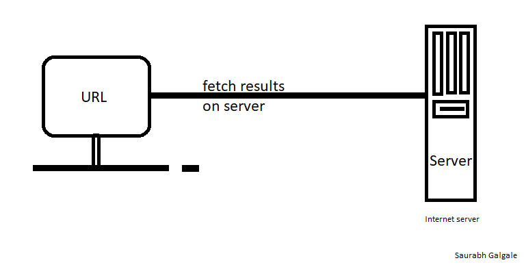

# **When a user enters an URL in the browser, how does the browser fetch the desired result?**

Ans =>
### URL
A URL (Uniform Resource Locator) is a unique identifier used to locate a resource on the Internet. It is also referred to as a web address. URLs consist of multiple parts -- including a protocol and domain name -- that tell a web browser how and where to retrieve a resource.

End users use URLs by typing them directly into the address bar of a browser or by clicking a hyperlink found on a webpage, bookmark list, in an email or from another application.

After hitting the URL, the first thing that needs to happen is to resolve IP address associated with the domain name. DNS helps in resolving this. DNS is like a phone book and helps us to provide the IP address that is associated with the domain name just like our phone book gives a mobile number which is associated with the person’s name.

This is the overview, but there are four layers through which this domain name query goes through. Let’s understand the steps:

1. After hitting the URL, the browser cache is checked. As browser maintains its DNS records for some amount of time for the websites you have visited earlier. Hence, firstly, DNS query runs here to find the IP address associated with the domain name.

2. The second place where DNS query runs in OS cache followed by router cache.

3. If in the above steps, a DNS query does not get resolved, then it takes the help of resolver server. Resolver server is nothing but your ISP (Internet service provider). The query is sent to ISP where DNS query runs in ISP cache.

4. If in 3rd steps as well, no results found, then request sends to top or root server of the DNS hierarchy. There it never happens that it says no results found, but actually it tells, from where this information you can get. If you are searching IP address of the top level domain (.com,.net,.Gov,. org). It tells the resolver server to search TLD server (Top level domain).

5. Now, resolver asks TLD server to give IP address of our domain name. TLD stores address information of domain name. It tells the resolver to ask it to Authoritative Name server.

6. The authoritative name server is responsible for knowing everything about the domain name. Finally, resolver (ISP) gets the IP address associated with the domain name and sends it back to the browser.

After getting an IP address, resolver stores it in its cache so that next time, if the same query comes then it does not have to go to all these steps again. It can now provide IP address from their cache.

This is all about the steps that is followed to resolve IP address that is associated with the domain name.

## a. What is the main functionality of the browser

A web browser takes you anywhere on the internet. It retrieves information from other parts of the web or server and displays it on your desktop or mobile device. The information is transferred using the Hypertext Transfer Protocol, which defines how text, images and video are transmitted on the web.

## b. High Level Components of a browser.

1.**The user interface:** this includes the address bar, back/forward button, bookmarking menu, etc. Every part of the browser display except the window where you see the requested page.

2.**The browser engine:** marshals actions between the UI and the rendering engine.

3.**The rendering engine:** responsible for displaying requested content. For example if the requested content is HTML, the rendering engine parses HTML and CSS, and displays the parsed content on the screen.

4.**Networking:** for network calls such as HTTP requests, using different implementations for different platform behind a platform-independent interface.

5.**UI backend:** used for drawing basic widgets like combo boxes and windows. This backend exposes a generic interface that is not platform specific. Underneath it uses operating system user interface methods.

6.**JavaScript interpreter:** Used to parse and execute JavaScript code.

7.**Data storage:** This is a persistence layer. The browser may need to save all sorts of data locally, such as cookies. Browsers also support storage mechanisms such as localStorage, IndexedDB, WebSQL and FileSystem.

## c. Rendering engine and its use.

### Role of Rendering Engine:
Once a user requests a particular document, the rendering engine starts fetching the content of the requested document. This is done via the networking layer. The rendering engine starts receiving the content of that specific document in chunks of 8 KBs from the networking layer. After this, the basic flow of the rendering engine begins.

The four basic steps include:

1.The requested HTML page is parsed in chunks, including the external CSS files and in style elements, by the rendering engine. The HTML elements are then converted into DOM nodes to form a “content tree” or “DOM tree.”

2.Simultaneously, the browser also creates a render tree. This tree includes both the styling information as well as the visual instructions that define the order in which the elements will be displayed. The render tree ensures that the content is displayed in the desired order.

3.Further, the render tree goes through the layout process. When a render tree is created, the position or size values are not assigned. The entire process of calculating values for evaluating the desired position is called a layout process. In this process, every node is assigned the exact coordinates. This ensures that every node appears at an accurate position on the screen.

4.The final step is to paint the screen, wherein the render tree is traversed, and the renderer’s paint() method is invoked, which paints each node on the screen using the UI backend layer.

As discussed earlier, every browser has its own unique rendering engine. So naturally, every browser has its own way of interpreting web pages on a user’s screen. Here’s where a challenge arises for web developers regarding the cross-browser compatibility of their website.

## d. Parsers

Once the browser receives the first chunk of data, it can begin parsing the information received. Parsing is the step the browser takes to turn the data it receives over the network into the DOM and CSSOM, which is used by the renderer to paint a page to the screen.

### DOM(Document Object Model)
The first step is processing the HTML markup and building the DOM tree. HTML parsing involves tokenization and tree construction. HTML tokens include start and end tags, as well as attribute names and values. If the document is well-formed, parsing it is straightforward and faster. The parser parses tokenized input into the document, building up the document tree.

### Preload scanner
While the browser builds the DOM tree, this process occupies the main thread. As this happens, the preload scanner will parse through the content available and request high priority resources like CSS, Web fonts.

### Building the CSSOM(css Object Model)
The second step in the critical rendering path is processing CSS and building the CSSOM tree. The CSS object model is similar to the DOM. The DOM and CSSOM are both trees. They are independent data structures. The browser converts the CSS rules into a map of styles it can understand and work with. The browser goes through each rule set in the CSS, creating a tree of nodes with parent, child, and sibling relationships based on the CSS selectors.

## e. Script Processors

Allows inline and stored scripts to be executed within ingest pipelines.

The aspects include browser systems and methods of loading/rendering a webpage by processing the web document (HTML page) in parallel. A scanner process scans the web document, identifies scripts, and initiates the downloading of the scripts. As the scripts are downloaded, an HTML parser generates an identifier for each script and the sends the scripts and associated identifiers to a script engine. The script engine parses, analyzes, compiles, and otherwise prepares the scripts for execution in an order that may be different than the execution order of the scripts.

## f. Tree construction
First, the browser combines the DOM and CSSOM into a "render tree," which captures all the visible DOM content on the page and all the CSSOM style information for each node.

## g. Order of script processing

It doesn't matter whether it's an external script or an inline script - they are executed in the order they are encountered in the page. Inline scripts that come after external scripts are held until all external scripts that came before them have loaded and run.

## h. Layout and Painting

The final output is a render that contains both the content and style information of all the visible content on the screen. With the render tree in place, we can proceed to the "layout" stage.

Up to this point we've calculated which nodes should be visible and their computed styles, but we have not calculated their exact position and size within the viewport of the device---that's the "layout" stage, also known as "reflow."

Finally, now that we know which nodes are visible, and their computed styles and geometry, we can pass this information to the final stage, which converts each node in the render tree to actual pixels on the screen. This step is often referred to as "painting" or "rasterizing."

