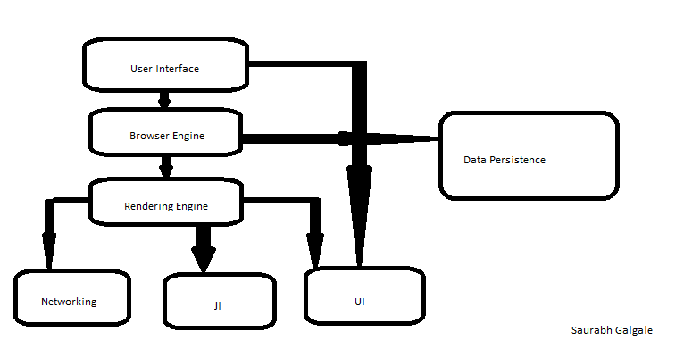

# **When a user enters an URL in the browser, how does the browser fetch the desired result?**

Ans =>
We use browsers to search information, videos, images and for other different tasks.this information is stored there on internet which we can accsess with the help of url. 

## a. Functionality of the browser
A web browser takes you anywhere on the internet. It retrieves information from other parts of the web or server and displays it on your desktop or mobile device. The information is transferred using the Hypertext Transfer Protocol, which defines how text, images and video are transmitted on the web.

### URL
A URL (Uniform Resource Locator) is a unique identifier used to locate a resource on the Internet. It is also referred to as a web address. URLs consist of multiple parts -- including a protocol and domain name -- that tell a web browser how and where to retrieve a resource.

After hitting the URL, the first thing that needs to happen is to resolve IP address associated with the domain name. DNS helps in resolving this. DNS is like a phone book and helps us to provide the IP address that is associated with the domain name just like our phone book gives a mobile number which is associated with the person’s name.

## b. High Level Components of a browser.

1.**The user interface:** this includes the address bar, back/forward button, bookmarking menu, etc. Every part of the browser display except the window where you see the requested page.

2.**The browser engine:** marshals actions between the UI and the rendering engine.

3.**The rendering engine:** responsible for displaying requested content. For example if the requested content is HTML, the rendering engine parses HTML and CSS, and displays the parsed content on the screen.

4.**Networking:** for network calls such as HTTP requests.

5.**UI backend:** used for drawing basic boxes and windows.

6.**JavaScript interpreter:** Used to parse and execute JavaScript code.

7.**Data storage:** This is a persistence layer. The browser may need to save all sorts of data locally, such as cookies.

## c. Rendering engine and its use.
Once a user requests a particular document, the rendering engine starts fetching the content of the requested document. This is done via the networking layer. The rendering engine starts receiving the content of that specific document in chunks of 8 KBs from the networking layer. After this, The requested HTML page is parsed in chunks including the external CSS files and in style elements, also creates a render tree. The final step is to paint the screen

Every browser has its own unique rendering engine. So naturally, every browser has its own way of interpreting web pages on a user’s screen. 

## d. Parsers
Once the browser receives the first chunk of data, it can begin parsing the information received. Parsing is the step the browser takes to turn the data it receives over the network into the DOM and CSSOM, which is used by the renderer to paint a page to the screen.

### DOM(Document Object Model)
The first step is processing the HTML and building the DOM tree. HTML parsing involves tokenization and tree construction. HTML tokens include start and end tags, as well as attribute names and values. If the document is well-formed, parsing it is straightforward and faster. The parser parses tokenized input into the document, building up the document tree.

### Preload scanner- request high priority sources.
While the browser builds the DOM tree, this process occupies the main thread. As this happens, the preload scanner will parse through the content available and request high priority resources like CSS, Web fonts.

### Building the CSSOM(css Object Model)
cssom is like a DOM tree only it works the same and it makes style structure to site and adds css tree.

## f. Tree construction
First, the browser combines the DOM and CSSOM into a "render tree," which captures all the visible DOM content on the page and all the CSSOM style information for each node.

## g. Order of script processing
It doesn't matter whether it's an external script or an inline script - they are executed in the order they are encountered in the page. Inline scripts that come after external scripts are held until all external scripts that came before them have loaded and run.

Finally we gets rendered user friendly website on our browser.

