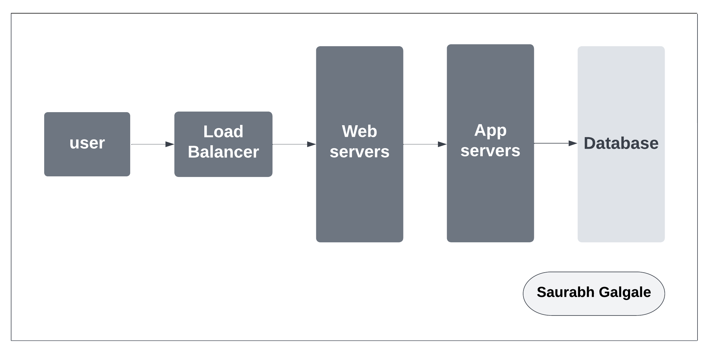
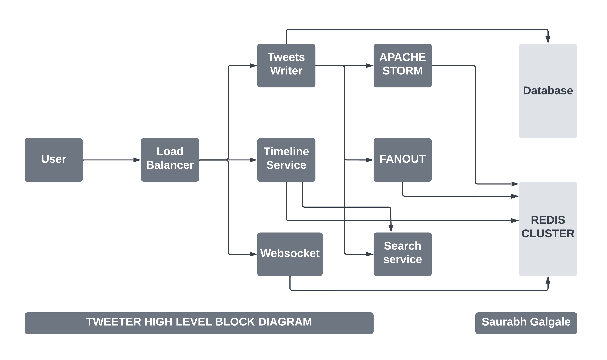

# High level system design for Twitter.

### Functional requirements.

- User should be able to tweet. 
- Should have Timelines -> Home timeline , User timeline, Search timeline.
- User should able to see trending hashtags and topics.

### Non-Functional requirements.

- High Availability
- Low latency
- consistency

### Capacity (Traffic Estimation). 

- 20 tweets / User / Day 
- DAUs(Daily Average Users) = 800M
- Total tweets / Day = 24 Billion Tweets.
- Total tweets / sec = 2,78,000 Tweets.

### Naive Approach

- Load balancer
- SQL database with user Table and tweets table (1 to M relation).
- system APIs - signup, login, write tweets, show followers, show tweets, etc.

### constraints
- Every time a user wants to get the feed, the select query must be applied to the tweet table. This is not practically possible due to the large user base.

### High level block diagram

- When a tweet is made, the API call hits the load balancer, and then that call hits the Twitter writer. The Twitter writer sends the copy of tweets to the database, Apache storm (for analyzing trending hashtags), the fanout service (to update the timeline), and the search service (for indexing).

- If the user wants to search for something, an API call is made to the load balancer, and then the request is forwarded to the timeline service. The call is then transferred to the search service, where the searching operation is efficiently performed using the scatter and gather strategy. Similarly, when the user requests a home timeline or user timeline, the request reaches the timeline service, which directly approaches Redis. Redis figures out the appropriate timeline and returns the result in JSON (JavaScript Object Notation) format.
 
- HTTP push WebSocket is responsible for handling the real-time connection with the application. This service should be able to handle millions of connections at any given point in time.

- ZooKeeper is a highly reliable coordination service for distributed components. Twitter runs about thousands of nodes in any given cluster for Redis. Most of the data is stored in Redis in big clusters, which requires coordination between the nodes. It also keeps track of which all servers are online/ offline and coordinates between the nodes accordingly. 

